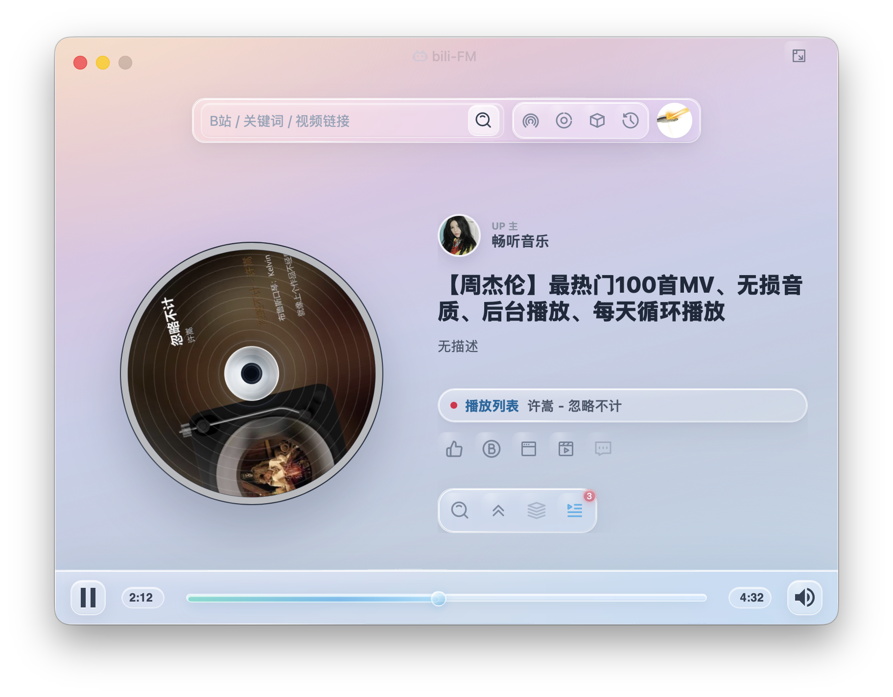

# Bili FM

[English](#english) | [中文](#中文)

---

## 中文

Bili FM 是一款通过音频收听 B 站视频内容的跨平台桌面应用，支持 Windows、macOS 和 Linux。它可以作为轻量音乐播放器，也适合用于课程、访谈、播客类视频和长视频内容的后台收听。



### 功能特性

- 采用液态玻璃风格 UI，半透明毛玻璃效果适配亮暗环境
- 支持关键词搜索 B 站视频，并可按时间、热度等条件排序
- 登录后可查看订阅、收藏、推荐等个人内容
- 支持播放、暂停、上一集、下一集、播放列表等常用播放控制
- 支持弹幕列表展示，方便在听音频时快速浏览视频互动内容
- 视频播放浮窗全屏铺满，带模糊遮罩与过渡动画
- 点击 UP 主名称或头像，可打开 UP 主作品列表
- 支持点赞、投币等常用互动操作
- 支持 Windows、macOS 和 Linux 多平台使用

### 适用场景

B 站电脑端暂未提供完整的"听视频"体验，Bili FM 主要面向以下场景：

- 后台收听知识类、访谈类、课程类和长视频内容
- 将视频内容作为音频播放，减少画面干扰
- 快速管理播放列表，连续收听多个视频
- 在桌面端获得更接近音乐播放器的 B 站收听体验

### 快捷键

| 快捷键 | 功能 |
| --- | --- |
| 空格 | 暂停 / 开始播放 |
| ← | 上一集 |
| → | 下一集 |

### 安装与更新

#### Windows

##### 微软应用商店（推荐）

现已上架 Microsoft Store，可直接在商店中搜索 **Bili FM** 安装，支持自动更新。

[Microsoft Store → Bili FM](https://apps.microsoft.com/store/detail/bili-fm/9N0LNL3JM3GG)

##### GitHub Release

如果更偏好手动安装包，可前往 GitHub Release 页面下载 `.exe` 安装文件：

[GitHub Releases](https://github.com/vst93/bili-fm/releases)

#### macOS 使用 Homebrew 安装

安装：

```bash
brew install vst93/tap/bili-fm
```

更新：

```bash
brew upgrade bili-fm
```

如果本地 Homebrew 未获取到最新版本，可先更新 Homebrew 索引后再升级：

```bash
brew update
brew upgrade bili-fm
```

### macOS 常见问题

#### 提示"应用已损坏，无法打开"

如果你从 GitHub Release 或 Homebrew 安装后，macOS 提示：

> "bili-FM"已损坏，无法打开。你应该将它移到废纸篓。

这是因为应用暂未经过 Apple Developer ID 签名和 notarization，macOS Gatekeeper 会拦截从网络下载的应用。

可以在终端执行以下命令移除 quarantine 标记：

```bash
xattr -dr com.apple.quarantine /Applications/bili-FM.app
```

如果应用仍在下载目录，请将路径改为实际位置，例如：

```bash
xattr -dr com.apple.quarantine ~/Downloads/bili-FM.app
```

执行完成后，再次打开应用即可。

### 开发说明

- 项目使用 Wails 开发，是一个跨平台桌面应用
- 前端使用 React + HeroUI 构建
- 项目开源，欢迎提出 Issue、建议或 Pull Request

项目地址：[https://github.com/vst93/bili-fm](https://github.com/vst93/bili-fm)

### 免责声明

本项目仅用于开发和学习。项目初衷是方便个人收听 B 站节目，不提供任何内容存储、分发或破解能力。所有视频、音频、弹幕等内容版权归原作者及哔哩哔哩所有。如有侵权，请联系删除。

### 感谢以下项目

- [Wails](https://github.com/wailsapp/wails)
- [HeroUI](https://github.com/heroui-inc/heroui)
- [IconPark](https://github.com/bytedance/iconpark)
- [bilibili-API-collect](https://github.com/SocialSisterYi/bilibili-API-collect)
- [react-audio-play](https://github.com/riyaddecoder/react-audio-play)
- [tiny-rdm](https://github.com/tiny-craft/tiny-rdm)

---

## English

Bili FM is a cross-platform desktop application that lets you listen to Bilibili video content as audio. It supports Windows, macOS, and Linux. It works as a lightweight music player and is also great for courses, interviews, podcasts, and long-form video content for background listening.


### Features

- Liquid glass UI design with translucent frosted glass effect that adapts to light/dark environments
- Search Bilibili videos by keyword, with sorting by time, popularity, etc.
- After login, access subscriptions, favorites, recommendations, and more
- Playback controls: play, pause, previous, next, playlist management
- Danmaku (bullet comments) list display for browsing interactions while listening
- Full-screen video player overlay with blur backdrop and smooth transitions
- Click a creator's name or avatar to open their video list
- Like, coin, and other common interactions supported
- Cross-platform: Windows, macOS, and Linux

### Use Cases

Bilibili's desktop client does not offer a complete "listen to video" experience. Bili FM is designed for:

- Background listening to educational, interview, course, and long-form content
- Playing video content as audio to reduce visual distraction
- Quick playlist management for continuous listening
- A more music-player-like Bilibili experience on desktop

### Keyboard Shortcuts

| Shortcut | Action |
| --- | --- |
| Space | Pause / Play |
| ← | Previous |
| → | Next |

### Installation & Updates

#### Windows

##### Microsoft Store (Recommended)

Bili FM is available on the Microsoft Store. Search for **Bili FM** in the store to install with automatic updates.

[Microsoft Store → Bili FM](https://apps.microsoft.com/store/detail/bili-fm/9N0LNL3JM3GG)

##### GitHub Release

Prefer a manual installer? Download the `.exe` from the GitHub Release page:

[GitHub Releases](https://github.com/vst93/bili-fm/releases)

#### macOS via Homebrew

Install:

```bash
brew install vst93/tap/bili-fm
```

Update:

```bash
brew upgrade bili-fm
```

If Homebrew doesn't find the latest version, update the index first:

```bash
brew update
brew upgrade bili-fm
```

### macOS Troubleshooting

#### "App is damaged and can't be opened"

After installing from GitHub Release or Homebrew, if macOS shows:

> "bili-FM" is damaged and can't be opened. You should move it to the Trash.

This happens because the app is not signed with an Apple Developer ID or notarized. macOS Gatekeeper blocks apps downloaded from the internet.

Remove the quarantine attribute in Terminal:

```bash
xattr -dr com.apple.quarantine /Applications/bili-FM.app
```

If the app is still in your Downloads folder, adjust the path accordingly:

```bash
xattr -dr com.apple.quarantine ~/Downloads/bili-FM.app
```

After that, open the app again.

### Development

- Built with Wails — a cross-platform desktop framework
- Frontend: React + HeroUI
- Open source — issues, suggestions, and pull requests are welcome

Repository: [https://github.com/vst93/bili-fm](https://github.com/vst93/bili-fm)

### Disclaimer

This project is for development and learning purposes only. The original goal is to facilitate personal listening to Bilibili content. It does not provide any content storage, distribution, or circumvention capabilities. All video, audio, and danmaku content belongs to the respective creators and Bilibili. If there is any infringement, please contact us for removal.

### Acknowledgements

- [Wails](https://github.com/wailsapp/wails)
- [HeroUI](https://github.com/heroui-inc/heroui)
- [IconPark](https://github.com/bytedance/iconpark)
- [bilibili-API-collect](https://github.com/SocialSisterYi/bilibili-API-collect)
- [react-audio-play](https://github.com/riyaddecoder/react-audio-play)
- [tiny-rdm](https://github.com/tiny-craft/tiny-rdm)
